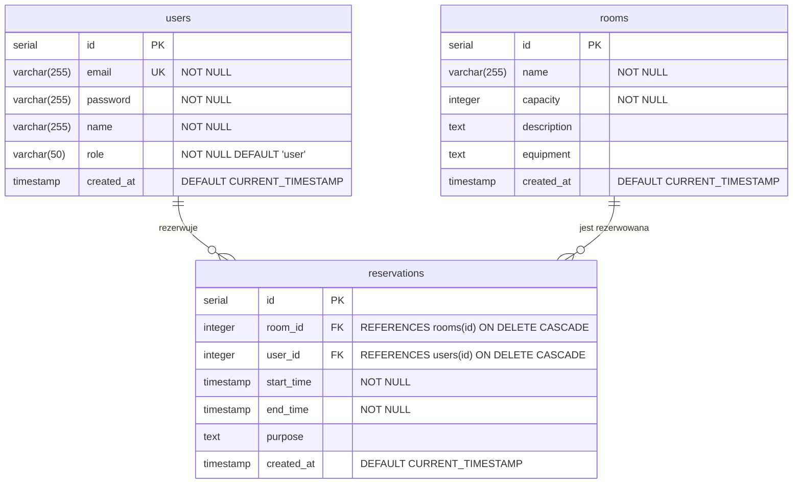

# MeetSpace - System Rezerwacji Sal Konferencyjnych

MeetSpace to nowoczesna aplikacja webowa do zarządzania rezerwacjami sal konferencyjnych. System umożliwia łatwe przeglądanie dostępnych sal, sprawdzanie ich dostępności w czasie rzeczywistym oraz zarządzanie rezerwacjami.

## Funkcjonalności

### Dla użytkowników
- Przeglądanie listy dostępnych sal konferencyjnych
- Sprawdzanie szczegółów sal (pojemność, wyposażenie)
- Tworzenie i zarządzanie rezerwacjami
- Przeglądanie historii własnych rezerwacji
- Anulowanie oczekujących rezerwacji

### Dla administratorów
- Zarządzanie salami konferencyjnymi (dodawanie, edycja, usuwanie)
- Przeglądanie wszystkich rezerwacji w systemie
- Zatwierdzanie lub odrzucanie rezerwacji
- Zarządzanie statusem sal (aktywna/nieaktywna)

## Wymagania techniczne

- PHP 8.0+
- PostgreSQL
- Nginx
- Docker

## Instalacja

1. Sklonuj repozytorium:
```bash
git clone https://github.com/xCaban/MeetSpace.git
cd MeetSpace
```

### Instalacja z użyciem Dockera

1. Zbuduj i uruchom kontenery:
```bash
docker-compose up -d
```

2. W folderze config, w pliku database.example.php znajduje się login i hasło do bazy. Zmień je na bezpieczne i zmień nazwe pliku na database.php

3. Aplikacja będzie dostępna pod adresem `http://localhost:8081`

## Struktura projektu

```
MeetSpace/
├── src/
│   ├── controllers/    # Kontrolery aplikacji
│   │   ├── AdminController.php
│   │   ├── AuthController.php
│   │   ├── DefaultController.php
│   │   ├── ReservationController.php
│   │   └── RoomController.php
│   ├── models/         # Modele danych
│   │   ├── Room.php
│   │   ├── User.php
│   │   └── Reservation.php
│   ├── views/          # Widoki
│   │   ├── admin/      # Panel administracyjny
│   │   ├── rooms/      # Widoki sal
│   │   ├── default/    # Strona główna


│   │   ├── reservations/ # Widoki rezerwacji
│   │   ├── security/   # Logowanie i rejestracja
│   │   └── layout.php/ # Szablon layoutu
├── public/             # Pliki publiczne (CSS, JS, obrazy)
├── config/             # Pliki konfiguracyjne dla bazy
└── docker/             # Konfiguracja Dockera i bazy
```

# Schemat ERD


## Opis relacji

1. **users - reservations**
   - Jeden użytkownik może mieć wiele rezerwacji (relacja 1:N)
   - Każda rezerwacja musi być przypisana do jednego użytkownika
   - Usunięcie użytkownika powoduje usunięcie wszystkich jego rezerwacji (ON DELETE CASCADE)

2. **rooms - reservations**
   - Jedna sala może mieć wiele rezerwacji (relacja 1:N)
   - Każda rezerwacja musi być przypisana do jednej sali
   - Usunięcie sali powoduje usunięcie wszystkich jej rezerwacji (ON DELETE CASCADE)

## Atrybuty tabel

### users
- `id`: Klucz główny, automatycznie inkrementowany
- `email`: Unikalny adres email (NOT NULL)
- `password`: Zahaszowane hasło (NOT NULL)
- `name`: Imię i nazwisko użytkownika (NOT NULL)
- `role`: Rola użytkownika (NOT NULL, domyślnie 'user')
- `created_at`: Data utworzenia konta (domyślnie CURRENT_TIMESTAMP)

### rooms
- `id`: Klucz główny, automatycznie inkrementowany
- `name`: Nazwa sali (NOT NULL)
- `capacity`: Maksymalna liczba osób (NOT NULL)
- `description`: Opis sali
- `equipment`: Wyposażenie sali
- `created_at`: Data dodania sali (domyślnie CURRENT_TIMESTAMP)

### reservations
- `id`: Klucz główny, automatycznie inkrementowany
- `room_id`: Klucz obcy do tabeli rooms (ON DELETE CASCADE)
- `user_id`: Klucz obcy do tabeli users (ON DELETE CASCADE)
- `start_time`: Data i godzina rozpoczęcia (NOT NULL)
- `end_time`: Data i godzina zakończenia (NOT NULL)
- `purpose`: Cel rezerwacji
- `created_at`: Data utworzenia rezerwacji (domyślnie CURRENT_TIMESTAMP)


## Bezpieczeństwo

- Wszystkie hasła są przechowywane w formie zahaszowanej
- Implementacja mechanizmu sesji
- Walidacja danych wejściowych
- Zabezpieczenie przed SQL Injection
- Kontrola dostępu do funkcji administracyjnych

# Screeny z aplikacji


